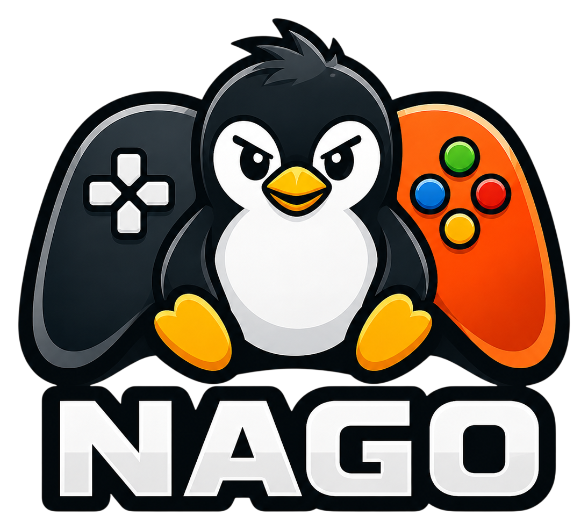
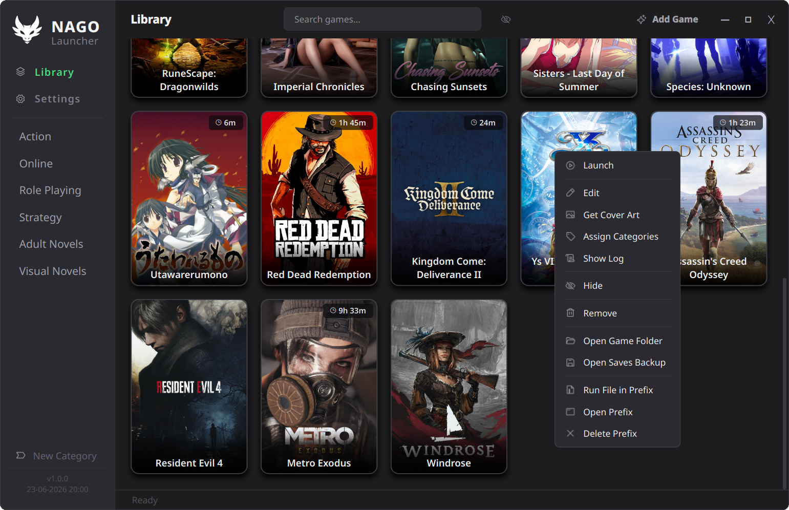

# NAGO Launcher

Smooth to use, good looking GUI, light and compact Linux Games-Launcher.

A Linux game launcher for Native, Proton, GOG, Steam, and Visual Novel games, plus Proton-based tools. Built with Python and PyQt6. In active development.

<p align="center"></p>

---

## Features

- **Multiple game types** — Native Linux, Proton (via umu-launcher), GOG, and Steam
- **Tools** — manage Proton-based utilities and launchers (mod managers, config tools, storefronts) as first-class entries alongside your games, each with its own Compatibility options
- **Shared or isolated Wine prefixes** — every game gets its own isolated prefix by default; tools can optionally share an existing game's prefix instead of creating their own, with a prefix picker that validates the target and de-duplicates against known prefixes
- **Tool UI Scale** — per-tool Wine DPI override for tools whose interface renders too small, applied only while that tool runs so games sharing the same prefix are unaffected
- **Cover art** — automatic fetching from SteamGridDB and VNDB
- **Import** — import games from Steam, Heroic, and Lutris libraries
- **Extended GOG support** — breadcrumb-based install detection, Heroic and Lutris GOG import
- **Extended Visual Novel support** — Japanese and Western VNs, VNDB cover search
- **AI upscaling** — per-game AI upscale toggle with model selection, powered by [linux-rt-upscaler](https://github.com/baronsmv/linux-rt-upscaler)
- **Per-game Wine prefixes** — each game gets its own isolated prefix
- **Save backups** — [ludusavi](https://github.com/mtkennerly/ludusavi) integration for backup and restore, with a versioned restore picker for choosing between multiple backups
- **In-game upscaler detection** — detects FSR 4, FSR 3.1, FSR 2, DLSS, and XeSS DLLs in game directories
- **Proton management** — auto-detects all installed Proton versions (GE-Proton, CachyOS Proton, Steam Proton, system-installed)
- **umu-launcher integration** — all Proton/GOG games run through umu unconditionally; auto-installs on first run
- **Sync support** — esync, fsync, and ntsync per game
- **FSR 4 / OptiScaler** — per-game FSR environment variable controls
- **Custom launch options** — pre/post launch commands, environment variable overrides
- **Categories** — organize your library with custom categories
- **Drag and drop** — reorder game cards by dragging
- **Light/Dark theme** — toggle between themes
- **Modern UI** — custom Qt stylesheet, bundled Inter font, Phosphor icon font, custom-styled comboboxes and dropdowns
- Built primarily for **KDE Wayland**, but should work on all desktop environments (more testing needed)
- No direct installer yet

---

## Screenshots

*Main library view*


*Edit Game — General tab*


*Edit Game — Compatibility tab*


*Add Game — Proton*


*Import Games — Steam / Heroic / Lutris*


*Settings*


---

## Requirements

### System packages

| Package | Purpose |
|---|---|
| `python` 3.10+ | Runtime |
| `qt6-wayland` | Native Wayland support (Hyprland, Sway, KDE Wayland, etc.) |

Install on Arch:
```bash
sudo pacman -S python qt6-wayland
```

Install on Fedora:
```bash
sudo dnf install python3 qt6-qtwayland
```

### Python packages

```bash
pip install PyQt6 requests Pillow
```

> If you use a virtual environment, create it with `--system-site-packages` if system Python packages are already installed, to avoid duplicating them.

### Runtime tools (auto-installed on first run)

NAGO will download and install these automatically to `~/.local/share/nago-launcher/tools/`:

- [umu-launcher](https://github.com/Open-Wine-Components/umu-launcher) — Proton/GOG game runner
- [ludusavi](https://github.com/mtkennerly/ludusavi) — save backup and restore
- [winetricks](https://github.com/Winetricks/winetricks) — Wine runtime installer

### Proton

NAGO does not bundle Proton. Install at least one:

- **GE-Proton** (recommended) — [Releases](https://github.com/GloriousEggroll/proton-ge-custom/releases) or AUR: `proton-ge-custom`
- **CachyOS Proton** — `sudo pacman -S proton-cachyos` (CachyOS only)
- **Steam Proton** — installed automatically if Steam is present

---

## Installation

1. Clone or download this repository.
2. Place all files in a directory of your choice, e.g. `~/nago-launcher/`.
3. Make sure the **`icons/`** and **`assets/`** folders are present alongside `nago-launcher.py`. NAGO loads its stylesheet and fonts from `assets/` and will not display correctly without it.
4. Run:

```bash
python nago.py
```

`nago.py` is a small launcher stub that caches NAGO's compiled bytecode, so every start after the first is a few hundred milliseconds faster. You can also run the main script directly:

```bash
python nago-launcher.py
```

Both work identically — `nago.py` is just the faster path. All development happens in `nago-launcher.py`.

### Folder layout

NAGO resolves its files relative to `nago-launcher.py` (or from `~/.local/share/nago-launcher/` when installed there). The expected layout is:

```
nago-launcher/
├── nago-launcher.py            # main application
├── nago.py                     # optional fast-launch stub (bytecode cache)
├── icons/                      # logo + SVG icons
│   ├── nago-logo.png
│   └── ...
└── assets/                     # stylesheet + fonts (required)
    ├── nago-launcher.qss
    ├── Inter-Regular.ttf
    ├── Inter-Medium.ttf
    ├── Phosphor.ttf
    └── Phosphor-Fill-stars.ttf
```

If a file in `assets/` is missing, the corresponding part of the UI degrades: no `nago-launcher.qss` means an unstyled window, missing Phosphor fonts means blank icons, and missing Inter falls back to the system sans-serif. The app still launches, but it will look broken — keep the folder intact.

### Optional: Desktop entry

To add NAGO to your application launcher:

```bash
cp nago-launcher.desktop ~/.local/share/applications/
```

Edit the `Exec=` and `Icon=` lines in the `.desktop` file to point to your install location.

---

## Notes

- All game data, prefixes, covers, and logs are stored under `~/.local/share/nago-launcher/`
- No hardcoded paths — NAGO respects `XDG_DATA_HOME` and runs from any location
- Tested on Fedora (KDE Wayland) and Arch Linux (Hyprland)

---

## Acknowledgements

- Built with the assistance of [Claude](https://claude.ai) by Anthropic
- AI upscaling powered by [linux-rt-upscaler](https://github.com/baronsmv/linux-rt-upscaler)
- Save backups powered by [ludusavi](https://github.com/mtkennerly/ludusavi)
- UI font: [Inter](https://github.com/rsms/inter) by Rasmus Andersson (SIL Open Font License 1.1)
- Icons: [Phosphor Icons](https://github.com/phosphor-icons/core) (MIT License)
